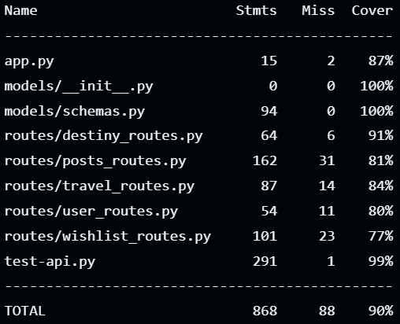

# Proyecto 1 de Base de datos 2 TEC (Red Social de Viajes)

## Autores: 
- Steven Sequeira 
- Brayton Solano
- Julian Madrigal

# Introducción

## Descripción

Este proyecto consiste en desarrollar el backend de una red social orientada a compartir experiencias de
viaje. El objetivo es que los usuarios puedan realizar publicaciones sobre sus viajes, agregar destinos a sus listas de objetivos de viaje y que otros usuarios interactúen con estas publicaciones mediante comentarios, likes y reacciones. Además, los usuarios podrán crear listas de destinos de viaje y asociar lugares a cada viaje. No se requiere frontend; el enfoque está en el backend, utilizando bases de datos Postgres, MongoDB y Redis, y desplegando todo el sistema mediante Docker y Docker Compose.

## Guía de instalación

-	Descargar el archivo .rar que contiene todos los archivos fuente del proyecto.
-	Abrir la localización en una terminal, se recomienda PowerShell o Bash.
-	Tener abierto y ejecutando el Docker Desktop.
-	En la terminal, insertar el comando docker-compose up –-build
NOTA: Todas las librerías y servicios necesarios se encuentran en el docker-compose.


# Comandos 

## Construye y ejecuta el contenedor de docker
``` bash
docker-compose up --build
```

## Ejecutar el módulo de pruebas unitarias
### Primero corra el contenedor en segundo plano
``` bash
docker-compose up -d --build
```

### Ejecutar las pruebas unitarias
``` bash
docker compose exec webapp poetry run coverage run -m unittest test-api -v
```

### Visualizar el reporte de la covertura de las pruebas unitarias
``` bash
docker compose exec webapp poetry run coverage report
```

### Ejemplo de como se vería el coverage



# Enlace a la documentación de la API 

Para visualizar la documentación de la api ingrese a:
[Click here](https://www.postman.com/technical-meteorologist-23381202/workspace/rest-api-py1-bd2-social-network/documentation/37666062-96306b9c-26f5-4e68-b97e-c99637c824b7)
